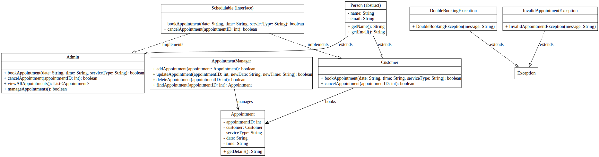
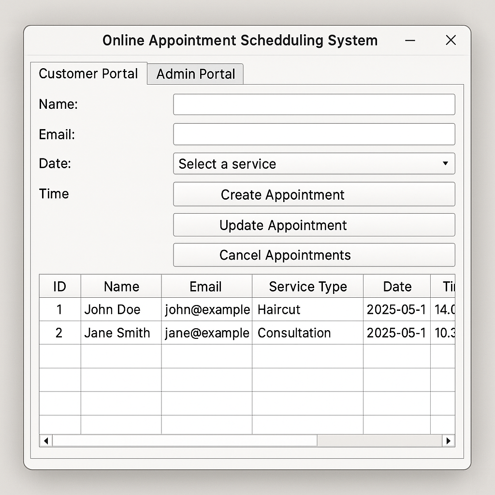

# Online Appointment Scheduling System

## 1. Real-World Scenario and Business Logic

The system models a real-world online appointment scheduling service. It can be used by businesses like clinics, salons, and consulting firms to manage customer bookings.

**Key Features:**
- Users (customers) can create, view, update, and cancel their appointments.
- Admins (service providers) can view and manage all appointments.
- Appointment data includes customer information (name, contact), appointment date/time, and service type.
- Simple login functionality to differentiate between Admin and User.

**Business Logic:**
- Customers can schedule available time slots.
- Double-booking for the same time slot is not allowed.
- Admins can open or block specific time slots.
- All appointment information is stored persistently.

## 2. OOP Design (Interface, Abstract Class, Inheritance)

### Class Structure:

- **Interface**: `Schedulable`
  - Defines common methods for scheduling (e.g., `bookAppointment()`, `cancelAppointment()`).

- **Abstract Class**: `Person`
  - Attributes: `name`, `email`
  - Common methods: `getName()`, `getEmail()`

- **Concrete Classes:**
  - `Customer` (extends `Person`)
  - `Admin` (extends `Person`)

- **Other Classes:**
  - `Appointment`
    - Attributes: `appointmentID`, `customer`, `serviceType`, `date`, `time`
  - `AppointmentManager`
    - Manages the list of all appointments (ArrayList)
    - Handles CRUD operations
  - `Custom Exceptions`
    - `DoubleBookingException` (extends Exception)
    - `InvalidAppointmentException` (extends Exception)

- **Polymorphism**:
  - `Customer` and `Admin` are treated as `Person` type.
  - `bookAppointment()` method behavior varies between `Customer` and `Admin`.

- **Method Overloading and Overriding:**
  - Overloading in `AppointmentManager` (e.g., `findAppointment(int id)`, `findAppointment(String email)`)
  - Overriding `toString()` in `Appointment`, `Customer`, etc.

### UML Diagram



## 3. GUI Window Design and Features

The system will use **Java Swing** to build a user-friendly interface.

**Main Window Components:**
- **Tabs**:
  - Customer Portal
  - Admin Portal
- **Input Fields**:
  - Name (JTextField)
  - Email (JTextField)
  - Date (JTextField)
  - Time (JTextField)
  - Service Type (JComboBox)
- **Buttons**:
  - Create Appointment (JButton)
  - Update Appointment (JButton)
  - Cancel Appointment (JButton)
  - View Appointments (JButton)
- **Display Area**:
  - JTable listing all scheduled appointments.

**Temporary Dialogs**:
- For updating appointment information.

**User Experience Features:**
- Input validation with pop-up error messages (e.g., empty fields, invalid time format).
- Confirmation messages after successful operations.
- Exception handling for double bookings and invalid data.



## 4. File I/O Design

**Data Storage:**
- Use a text file (`appointments.txt`) to store all appointment data.
- Each appointment saved in a line (e.g., CSV format).

**Loading Data:**
- When the program starts, `AppointmentManager` will read from `appointments.txt` and populate the ArrayList.

**Saving Data:**
- When the program exits, `AppointmentManager` writes the current state of appointments back into `appointments.txt`.

**Sample Line Format:**
```
1,John Doe,john@example.com,Haircut,2025-05-01,14:00
```

**Error Handling:**
- Catch file not found and IO exceptions.
- Validate data integrity during file loading.

---